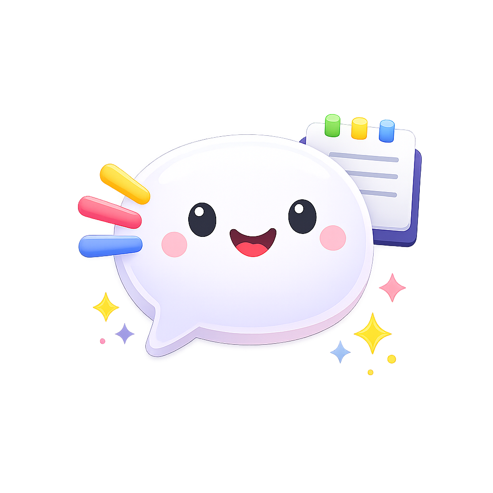

<p align="center">
  
</p>

<h1 align="center">Mumble</h1>

<p align="center">
  <strong>Talk to your Mac. It types back.</strong><br/>
  A tiny, <strong>completely free</strong> menu bar app that turns your voice into text — instantly.
</p>

<p align="center">
  Hold <kbd>Fn</kbd> &rarr; speak &rarr; release &rarr; text appears at your cursor.
  <br/>That's it. That's the app.
</p>

---

## Why Mumble?

Because typing is overrated. Mumble sits quietly in your menu bar and lets you dictate into **any** text field on macOS. It figures out where you are — Slack, email, iMessage, a Google Doc — and adjusts the tone to match.

Casual message to a friend? Mumble keeps it chill. Work email? Mumble cleans it up. You just talk.

### Completely Free

Mumble is powered by [Groq](https://groq.com)'s `whisper-large-v3-turbo` model — one of the fastest and most accurate speech-to-text models available. Groq's free tier requires **no credit card** and gives you:

- **2,000 requests/day** — that's 2,000 individual dictations
- **8 hours of audio/day** (28,800 seconds) — more than enough for all-day use
- **20 requests/minute** — plenty for natural dictation

Just grab a free API key from [console.groq.com](https://console.groq.com) and you're set. No subscriptions, no trials, no catch.

## What You Get

- **Push-to-talk with Fn** — hold to record, release to transcribe. No clicking, no waiting.
- **Instant text insertion** — transcribed text drops right into whatever app you're using.
- **Context-aware tone** — Mumble detects the active app and adjusts formatting automatically.
- **Blazing fast transcription** — powered by Groq's `whisper-large-v3-turbo` (seriously, it's fast).
- **Zero clutter** — lives in the menu bar, no Dock icon, no windows in your way.
- **Guided setup** — onboarding walks you through API key, permissions, and preferences.

## Smart Formatting

Mumble doesn't just transcribe — it formats. An LLM pass automatically structures your dictation based on the active app:

| Context | What it does |
|---|---|
| **Email** (Gmail, Outlook, Apple Mail) | Structures greeting / body / sign-off with proper paragraph flow |
| **Messaging** (Slack, iMessage, Discord) | Keeps text casual, converts spoken emoji names to symbols |
| **Code** (VS Code, Xcode, Terminal) | Preserves technical terms, avoids autocorrect-style changes |
| **General** (everything else) | Clean sentences with standard punctuation |

Context is detected from the frontmost app's bundle ID and, for browsers, the page title. Smart formatting is enabled by default and can be toggled off in Settings.

## Getting Started

**You'll need:** macOS 14+ (Sonoma), Xcode 15+, and a free [Groq API key](https://console.groq.com/) (no credit card required).

```bash
brew install xcodegen          # one-time setup
cd /path/to/Mumble
xcodegen generate              # generate the Xcode project
open Mumble.xcodeproj          # Cmd+R to build and run
```

The app will walk you through the rest.

## How It Works

```
    You speak        Mumble listens       Groq transcribes      Smart formatting     Text appears
  ┌──────────┐      ┌─────────────┐      ┌────────────────┐    ┌───────────────┐    ┌───────────┐
  │ Hold Fn  │ ──▶  │  Record mic │ ──▶  │  Whisper API   │ ──▶│ Context-aware │ ──▶│ At cursor │
  └──────────┘      └─────────────┘      └────────────────┘    │   LLM format  │    └───────────┘
                                                                └───────────────┘
                                                                       ▲
                                                                ┌──────┴───────┐
                                                                │ Detect app:  │
                                                                │ email? chat? │
                                                                │ code? other? │
                                                                └──────────────┘
```

Under the hood: **DictationManager** orchestrates everything — shortcut monitoring, audio recording, Groq API transcription, context-aware formatting, and text insertion via Accessibility APIs.

## Troubleshooting

| Problem | Fix |
|---|---|
| **Fn key not working** | System Settings > Keyboard > set "Press fn key to" → **Do Nothing** |
| **No accessibility permission** | System Settings > Privacy & Security > Accessibility > enable Mumble |
| **No microphone permission** | System Settings > Privacy & Security > Microphone > enable Mumble |
| **Text not inserting** | Make sure a text field is focused in the target app before recording |

> Rebuilt or moved the app? You may need to remove the old Accessibility entry and re-add it.

## Known Limitations

- Fn key can conflict with certain macOS keyboard settings
- Browser URL detection doesn't work with all browsers
- Requires an internet connection (no offline fallback yet)
- Only Fn key is supported for now (custom hotkeys coming soon)

## On the Roadmap

- Custom hotkey support
- Multi-language transcription
- Local Whisper model for offline use
- User-defined tone profiles
- Clipboard history for recent transcriptions

## License

See [LICENSE](LICENSE) for details.
