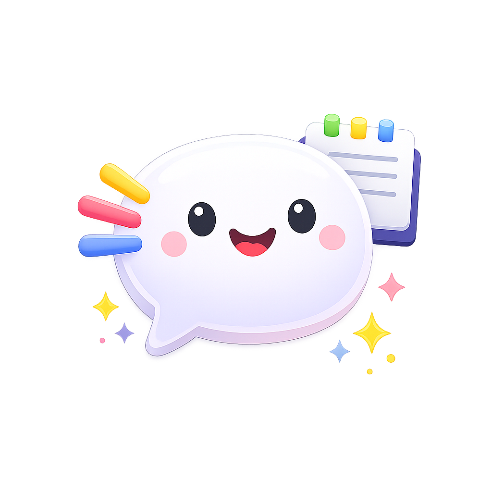

<p align="center">
  
</p>

<h1 align="center">Mumble</h1>

<p align="center">
  <strong>Talk to your Mac. It types back.</strong><br/>
  A tiny, <strong>completely free</strong> menu bar app that turns your voice into text — instantly.
</p>

<p align="center">
  Hold <kbd>Fn</kbd> &rarr; speak &rarr; release &rarr; text appears at your cursor.
  <br/>Exactly the way you wanted it.
</p>

<p align="center">
  <a href="https://github.com/kdelmotte/Mumble/releases/latest">
    
  </a>
  <br/>
  <sub>Signed &amp; notarized &middot; macOS 14+</sub>
</p>

---

## Why Mumble?

Because typing is overrated. Mumble sits quietly in your menu bar and lets you dictate into **any** text field on macOS. It figures out where you are — Slack, email, iMessage, a Google Doc — and adjusts the tone to match.

Casual message to a friend? Mumble keeps it chill. Work email? Mumble cleans it up. You just talk.

### Bring Your Own Provider

Mumble now supports multiple transcription providers and lets you choose the model you want per provider:

- **Groq**
- **Fireworks AI**
- **ElevenLabs**
- **Deepgram**
- **AssemblyAI**

If you want the easiest free setup, [Groq](https://groq.com) is still a great default. Its free tier requires **no credit card**, and Mumble can also use a saved Groq key for optional Smart Formatting.

## What You Get

- **Push-to-talk with Fn** — hold to record, release to transcribe. No clicking, no waiting.
- **Instant text insertion** — transcribed text drops right into whatever app you're using.
- **7-day recovery history** — every completed transcription is kept locally for 7 days in a dedicated History tab so you can recover text if paste misses.
- **Context-aware tone** — Mumble detects the active app and adjusts formatting automatically.
- **Provider and model choice** — pick the transcription provider and model that fit your workflow.
- **Zero clutter** — lives in the menu bar, no Dock icon, no windows in your way.
- **Guided setup** — onboarding walks you through API key, permissions, and preferences.
- **Custom dictionary** — add vocabulary corrections so Mumble always spells your names, jargon, and brand terms the right way.
- **Smart formatting** — an optional Groq-backed LLM pass automatically structures your dictation based on the active app (email gets greeting/body/sign-off, messaging stays casual with emoji, code preserves technical terms, and everything else gets clean punctuation). Detected from the frontmost app's bundle ID and page title; toggleable in Settings.

## Getting Started

### Download

Grab the latest release from [GitHub Releases](https://github.com/kdelmotte/Mumble/releases/latest) — the app is signed and notarized, so you can run it straight away. Requires **macOS 14+** (Sonoma) and at least one supported transcription provider API key. If you want Smart Formatting, save a Groq key as well.

The app will walk you through the rest.

### Build from Source

For contributors or if you prefer to build locally — you'll need Xcode 15+ and at least one supported transcription provider API key.

```bash
brew install xcodegen          # one-time setup
cd /path/to/Mumble
xcodegen generate              # generate the Xcode project
open Mumble.xcodeproj          # Cmd+R to build and run
```

## How It Works

```
    You speak        Mumble listens      Selected provider      Optional formatting    Text appears
  ┌──────────┐      ┌─────────────┐      ┌────────────────┐    ┌────────────────┐    ┌───────────┐
  │ Hold Fn  │ ──▶  │  Record mic │ ──▶  │ STT API + model│ ──▶│ Groq or local  │ ──▶│ At cursor │
  └──────────┘      └─────────────┘      └────────────────┘    │ context format │    └───────────┘
                                                                └────────────────┘
                                                                       ▲
                                                                ┌──────┴───────┐
                                                                │ Detect app:  │
                                                                │ email? chat? │
                                                                │ code? other? │
                                                                └──────────────┘
```

Under the hood: **DictationManager** orchestrates everything — shortcut monitoring, audio recording, provider-specific transcription, optional Groq-backed Smart Formatting, and text insertion via Accessibility APIs.

## Troubleshooting

| Problem | Fix |
|---|---|
| **Fn key not working** | System Settings > Keyboard > set "Press fn key to" → **Do Nothing** |
| **No accessibility permission** | System Settings > Privacy & Security > Accessibility > enable Mumble |
| **No microphone permission** | System Settings > Privacy & Security > Microphone > enable Mumble |
| **Text not inserting** | Make sure a text field is focused in the target app before recording. If a paste still misses, open History in Settings and copy the saved transcription. |

> Rebuilt or moved the app? You may need to remove the old Accessibility entry and re-add it.

## Known Limitations

- Fn key can conflict with certain macOS keyboard settings
- Browser URL detection doesn't work with all browsers
- Requires an internet connection (no offline fallback yet)
- Only Fn key is supported for now (custom hotkeys coming soon)

## On the Roadmap

- Custom hotkey support
- Multi-language transcription
- Local Whisper model for offline use
- User-defined tone profiles

## License

See [LICENSE](LICENSE) for details.
